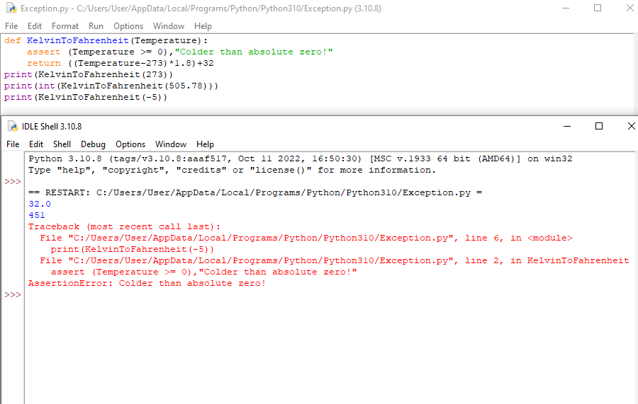
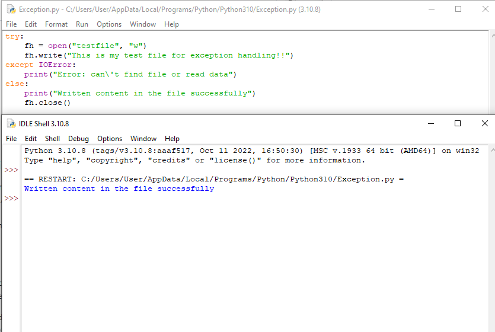
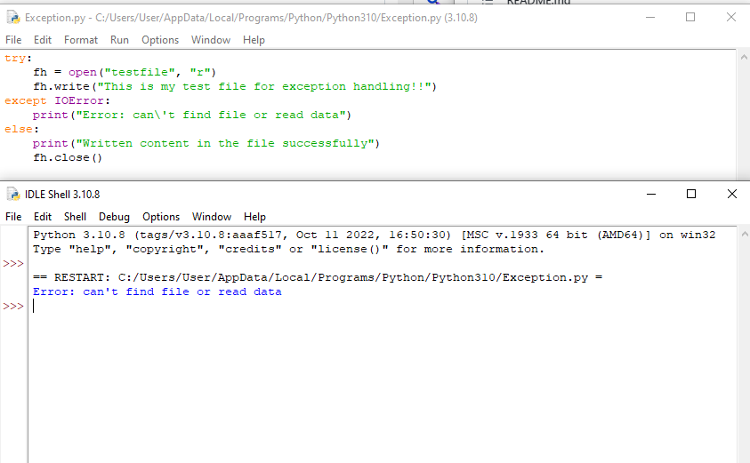
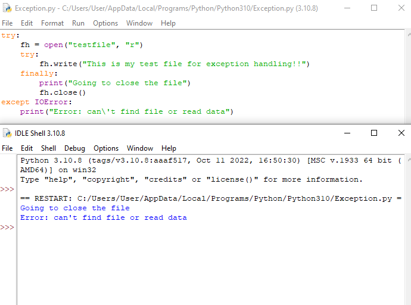
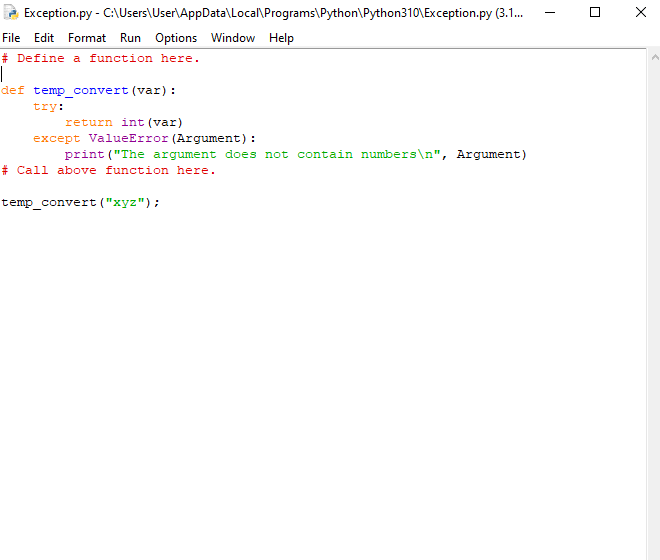
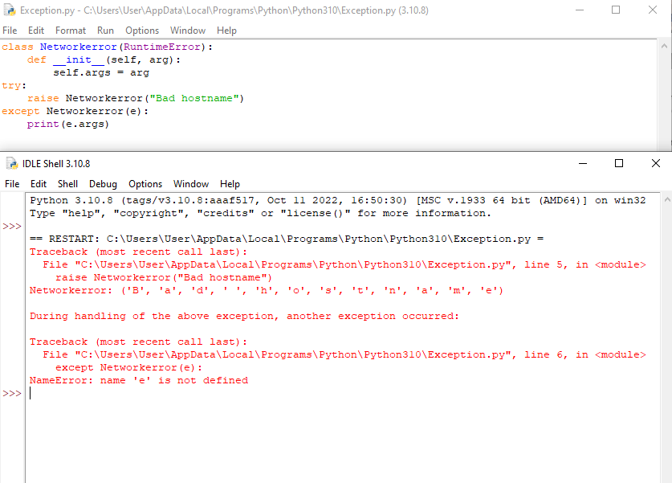
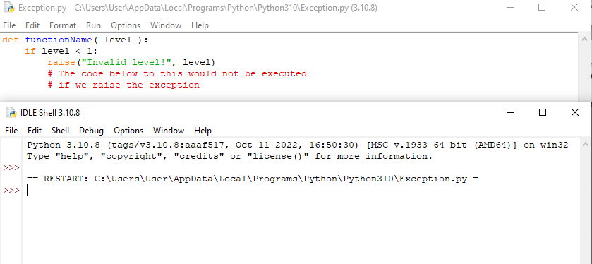

# praktikum11
nama  : Fazri al badawi
kelas : TI 22 C1
Nim   :312210061
# Exception Handling
- Exception (eksepsi) merupakan suatu kesalahan (error) yang terjadi saat proses eksekusi program sedang berjalan
- Kesalahan ini akan menyebabkan program berakhir dengan tidak normal.

# Penanganan 
- file adalah bagian penting dari aplikasi apa pun.

# Tuntutan 
- penegesan (pernyataan) adalah kewajaran program yang kamu bisa aktif/nonaktifkan ketika kamu selesai menjalankan program.

# pernyataan Tegas
Saat menemukan pernyataan, Python mengevaluasi ekspresi yang menyertainya, yang mana semoga benar. Jika ekspresi salah, Python memunculkan pengecualian AssertionError. 

# Sintaks untuk pernyataan yaitu :
 assert Expression[, Arguments]

Jika pernyataan gagal, Python menggunakan ArgumentExpression. ArgumentExpression sebagai argumen-argumen untuk AssertionError. Pengecualian AssertionError dapat ditangkap dan ditangani seperti pengecualian lainnya menggunakan try kecuali pernyataan, tetapi jika dibiarkan mereka akan menghentikan program dan menghasilkan backtrace.

# Contoh :
- Berikut adalah fungsi fungsi yang mengubah suhu dari derajat Kelvin menjadi derajat Fahrenheit.Karena nol derajat Kelvin dingin, fungsi fungsi menyimpannya jika melihat negatif negatif suhu.
- Ketika kode di bawah dijalankan, menghasilkan hasil sebagai berikut:

# Langkah Pengecualian
Jika Anda memiliki beberapa kode mencurigakan yang mungkin mengeluarkan pengecualian, Anda dapat mempertahankan program Anda letakkan kode yang mencurigakan di *try: blok. Setelah coba: blok, sertakan pernyataan sertakan *except: statement, diikuti oleh blok kode yang menangani masalah seanggun mungkin.

# Contoh :
- Contoh-contoh ini membuka file, menulis konten file, dan keluar dengan aman karena ada tidak masalah
- Ketika kode di bawah dijalankan, menghasilkan hasil sebagai berikut:

- Contoh ini mencoba membuka file yang Anda tidak memiliki izin menulis, sehingga membuat file pengecualian
- Ketika kode di bawah dijalankan, menghasilkan hasil sebagai berikut:

# Fasal kecuali tanpa Pengecualian
- Anda juga dapat menggunakan pernyataan exception tanpa exception yang didefinisikan sebagai berikut:
coba: Anda melakukan operasi anda di sini; ...................... except: If there is any exception, then execute this block. ...................... else: If there is no exception then execute this block.

Pernyataan coba-kecuali jenis ini menangkap semua pengecualian pengecualian yang terjadi. Menggunakan percobaan seperti try-expect pernyataan tidak dianggap sebagai praktik pemrograman yang baik, karena mereka menangkap semuanya pengecualian tetapi tidak membuat programmer mengidentifikasi kemungkinan penyebab masalah terjadi

# Klausa kecuali dengan Berbagai Pengecualian
- Anda juga dapat menggunakan pernyataan exception yang sama untuk menangani beberapa exception sebagai berikut:
try: You do your operations here; ...................... except(Exception1[, Exception2[,...ExceptionN]]]): If there is any exception from the given exception list, then execute this block. ...................... else: If there is no exception then execute this block.

# Klausa coba-akhirnya
Contoh :
- Jika Anda tidak memiliki izin untuk membuka file dalam mode tulis yang dapat ditulis, maka ini akan menghasilkan hasil berikut:

Contoh yang sama dapat ditulis lebih bersih sebagai berikut:

Ketika exception dilempar ke dalam blok try, eksekusi segera dilanjutkan ke akhir memblok. Setelah semua pernyataan di blok akhirnya dieksekusi, pengecualian dimunculkan lagi dan ditangani dalam pernyataan kecuali jika ada di lapisan berikutnya yang lebih tinggi dari percobaan-kecuali penyataan.
Argumen Pengecualian
Contoh :
Berikut adalah contoh untuk satu pengecualian
Ketika kode di bawah dijalankan, menghasilkan hasil sebagai berikut:

# Melempar Pengecualian
Contoh :
- Pengecualian dapat berupa string, kelas, atau objek. Sebagian besar pengecualian adalah pengecualian dari inti Python menimbulkan adalah kelas dengan argumen=argumen yang merupakan turunan dari kelas. Mendefinisikan pengecualian baru cukup mudah dan dapat dilakukan sebagai berikut:

# Pengecualian yang ditetapkan pengguna
- Python juga memungkinkan Anda membuat pengecualian sendiri dengan menurunkan kelas-kelas dari yang standar pengecualian bawaan.
- Berikut adalah contoh-contoh yang terkait dengan RuntimeError. Di sini, kelas dibuat yang merupakan subkelas dari subkelas RuntimeError. Ini berguna saat anda perlu menampilkan tampilan informasi yang lebih spesifik saat e pengecualian tertangkap.
- Di blok try, pengecualian yang ditentukan pengguna dimunculkan dan ditangkap di blok except. Itu variabel e digunakan untuk membuat instance dari kelas Networkerror.

# Sekian, Terima kasih